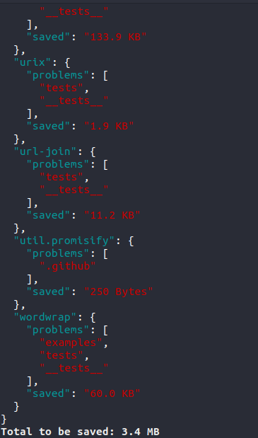

<p align="center"><h1 align="center">
  node-modules-analyzer
</h1>

<p align="center">
  
</p>

<p align="center">
  <a href="https://www.npmjs.org/package/node-modules-analyzer"></a>
  <a href="https://www.npmjs.org/package/node-modules-analyzer"></a>
  <a href="https://www.npmjs.org/package/node-modules-analyzer"></a>
  <a href="https://travis-ci.org/playma256/node-modules-analyzer"></a>
  <a href="https://codecov.io/gh/playma256/node-modules-analyzer"></a>
  <a href="https://snyk.io/test/github/playma256/node-modules-analyzer"></a>
  <a href="./SECURITY.md"></a>
</p>

# About

`node-modules-analyzer`

Shows a report of all "defects" inside your node modules, which are folders and files that should have not been published by package authors!

You can get a small report of what are the problems and how much space can be saved up on each package and if you fix your entire `node_modules` folder!




## Install

```bash
yarn add -D node-modules-analyzer
```

# Usage

```bash
npx node-modules-analyzer
```

It will automatically get the node_modules that is on the current directory you are!

if you run 
```bash
npx node-modules-analyzer --path ../node_modules
```

it will pick up the path you give it!

# Contributing

Please consult [CONTRIBUTING](./CONTRIBUTING.md) for guidelines on contributing to this project.

# Author

**node-modules-analyzer** © [PlayMa256](https://github.com/playma256), Released under the [Apache-2.0](./LICENSE) License.
